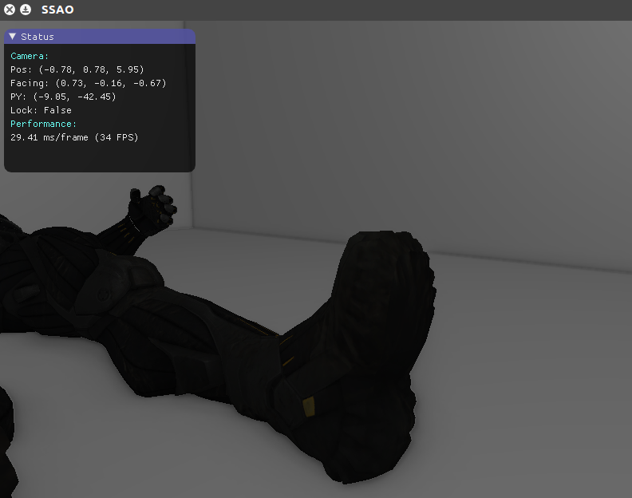
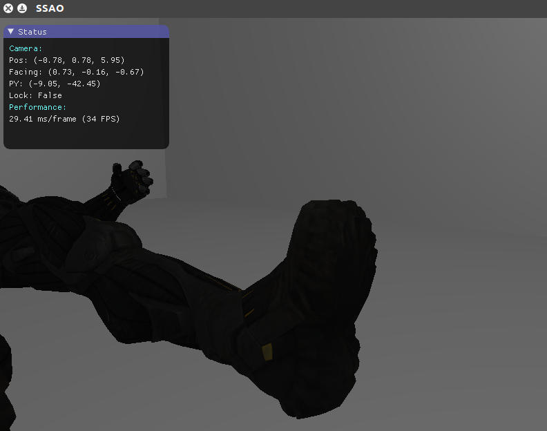
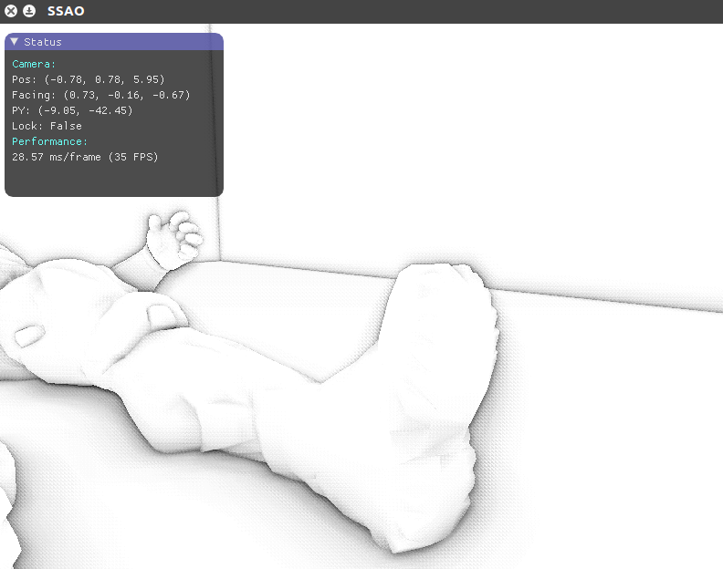
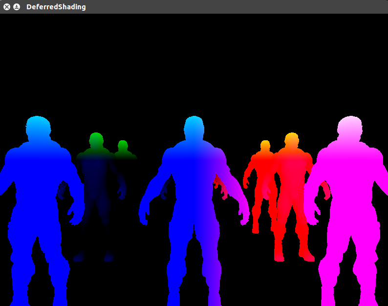

### My Learning Experiences of Morden OpenGL ###

_ _ _

Some results of each sections(updating...):

---  

26 SSAO:  

| WITH SSAO | WITHOUT SSAO |
| --- | --- |
|   |   |

| Not Random Rotation | Not Range Check | Not Blur | Full SSAO | With Diffuse |
| --- | --- | --- | --- | --- |
|   |   |   |   |   |

_ _ _

25 Deferred Shading:  

G-Buffer Viewing

|   |  |
| --- | --- |
|    |   |

In my nVidia GT650m with 128 point lights in the scene.

Models were drawed from back to front.

Forward shading is not stable, since fragment shaders were call differ from view position.

| Deferred Shaidng | Forward Shading |
| --- | --- |
|  stable at 19ms/frame  |  27 ~ 37ms/frame |
_ _ _

24 PBR:  

  
  
  
  
  

_ _ _

23 Bloom:  

| Without Bloom | With Bloom |
| --- | --- |
|    |   | 

_ _ _

22 HDR:  

| Without HDR | With HDR |
| --- | --- |
|    |   | 

_ _ _

21 Parallax Mapping

| Only Diffuse | Diffuse + Normal Mapping | Diffuse + Normal + Parallax Mapping |
| --- | --- | --- |
|    |    |   
|    |    |   

_ _ _

20 Omnidirectional Shadow Maps

Shadow from a point light at (0, 0, 0): 

_ _ _

19 Shadow Mapping:  

Shadow and lighting with point light:

Shadow and lighting with directional light: 

_ _ _

18 Normal Mapping:  

| Without Normal Mapping | With Normal Mapping |
| --- | --- |
|    |   | 

_ _ _

17 Gamma Correction:  

| Linear Attenuation, No Gamma Correction | Quadratic Attenuation, No Gamma Correction | Linear Attenuation, Gamma Correction | Quadratic Attenuation, Gamma Correction|
| --- | --- | --- | --- |
|    |   |    |    |

_ _ _

16 Advanced Lighting:

Pure Phong Shading:  
  
Blinn-Phong Shading:  
  

_ _ _

Whims: Animation《Magic of Stella》's ending scene.

_ _ _

15 GeometryShader:

_ _ _

14 CubeMaps:

_ _ _
  
Whims: A Mirror! 

_ _ _

13 Model Loading:

_ _ _

12 MultipleLights:

_ _ _

11 LightCaster(Different kinds of light):

_ _ _
10 LightMaps:

_ _ _
09 Materials:

_ _ _
08 BasicLighting

_ _ _
07 Colors

_ _ _
06 Camera

_ _ _
05 CoordinateSystem

_ _ _
04 Transformations

_ _ _
03 Textures

_ _ _
02 Shaders

_ _ _
01 HelloTriangle

_ _ _
